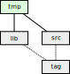

layout: default.liquid
title:  "My $HOME"
published_date: "2018-09-03 16:18:53 +0000"
is_draft: false
data:
  route: "blog"
---

Recently, I came across a blog posting titled "[$HOME, sweet $HOME](https://morr.cc/home-sweet-home/)", where [@blinry](https://morr.cc/) advocates for structuring your `$HOME` directory based on projects and their activity.
After reading this I felt inspired to finally have a look at the mess I made of my `$HOME` in the last years.

A few things about my old `$HOME`:
- ``Documents`` contained basically everything I had accumulated during the last years besides music, videos, pictures and source code.
- ``projects`` just contained one gigantic folder of all projects that I ever worked on.
- the rest was based on the default [xdg-user-dirs](https://freedesktop.org/wiki/Software/xdg-user-dirs/)

If you sorted the files by file type like the default XDG directories suggest, files from one project may be scattered across many different directories.

So my goal for the new `$HOME` was to have a clean directory structure where:
 - it is obvious where to place new files
 - paths do not become too long to type out
 - the directory structure relates to how I work

A quick tour of my new `$HOME`:

| directory  | usage                            | sorted by             |
| :--------- | :------------------------------- | :---------------      |
| lib        | immutable files                  | media-type/           |
| src        | mutable files                    | project-name/         |
| tag        | stores links to projects         | tag-name/project-name |
| tmp        | unsorted files, downloads        | (chaotic)             |

## The project directory

All of my projects are stored in `src`.
I use a flat directory structure, where every project has its own subdirectory based on its name.
Projects can become part of one or more larger contexts through the use of tags. 

## Tags

Tag directories are stored in `tag`.
Each directory stores symbolic links to parts of a project that can be distributed around `lib` and `src`.
One possible use for the tag directories is creating workbenches.
If I use some directories in `lib` or `src` in different contexts, `tag` can be used to include them in multiple workbenches.

An example workflow
```shell
$ cd tag
$ mkdir -p course1/examples
$ ln -s ~/src/example1 course1/examples/
$ ln -s ~/lib/courses/course1 course1/material
$ rm -r course1
```

I create new tags for various reasons, but mostly one for each larger context (e.g. work, hobbies, admin foo, thesis, courseXY) and some more for tracking project activity.
There are four different tags in `tag` directory right now for tracking project activity:

| directory  | usage                            | structure        | change files   |
| :--------- | :------------------------------- | :--------------- | :------------: |
| permanent  | links to permanent projects      | project-name/    | yes            |
| active     | links to active projects         | project-name/    | yes            |
| hold       | links to inactive projects       | project-name/    | no             |
| dead       | links to dead projects           | project-name/    | no             |

## Workflow


